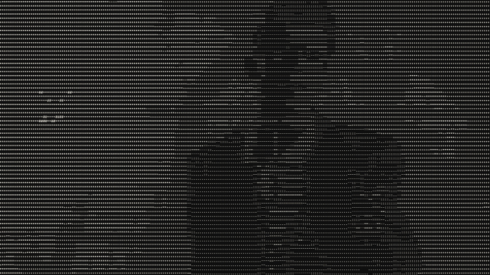
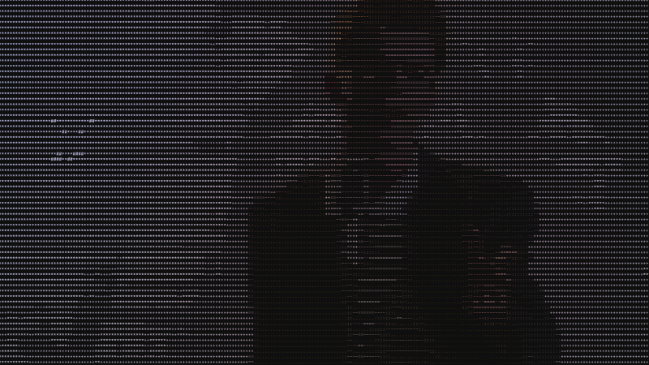
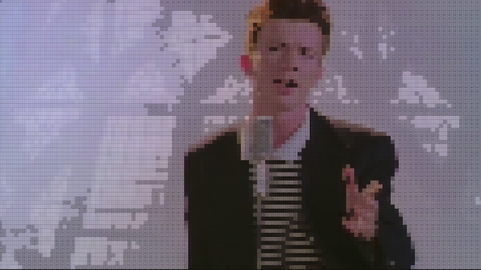
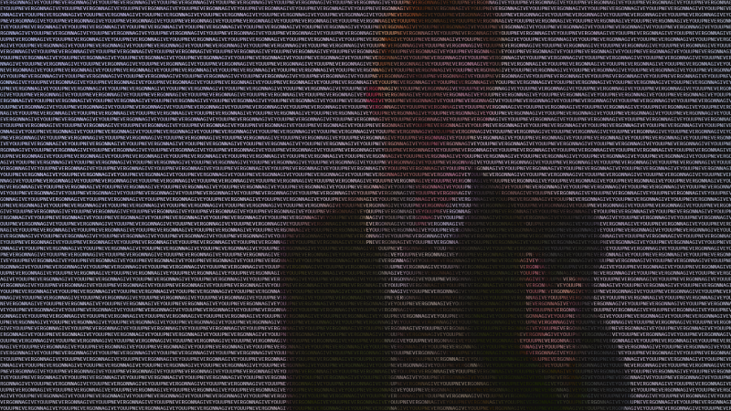

# Imgtoascii

A program that converts images into ASCII art

## Requirements

- Python3
- Pillow

## Usage

Clone the project and run `pip install` and `py main.py image_path`

Available options:

- `--cols` _columns (or width) of the output image_

  If the art is printed to terminal and cols exceedes terminal width, it will automatically resize to fit, same if the specified width exceeds the original width

- `--color` _print colored characters instead of monochrome_

  Works when priting to terminal or saving as png, not when saving as file

- `--fill` _use filled characters instead of letters and symbols_

  Works when priting to terminal, saving as text file or saving as png, both color and monochrome

- `--chars` _characters to use instead of default grayscale_

  Works when priting to terminal not when saving as file or png, both color and monochrome

- `--output` _print result in the specified file_
- `--png` _save ASCII art as PNG image_

## Examples

### Monochrome

### Color

### Fill

### Characters

## References

- [Pillow](https://pillow.readthedocs.io/en/stable/reference/Image.htm)
- [Paul Bourke grayscale](https://paulbourke.net/dataformats/asciiart/)
- [ProfOak Ascii_py](https://github.com/ProfOak/Ascii_py/https://github.com/ProfOak/Ascii_py/)
- [How does image to ascii work](https://asciieverything.com/ascii-tips/how-does-image-to-ascii-work/)
